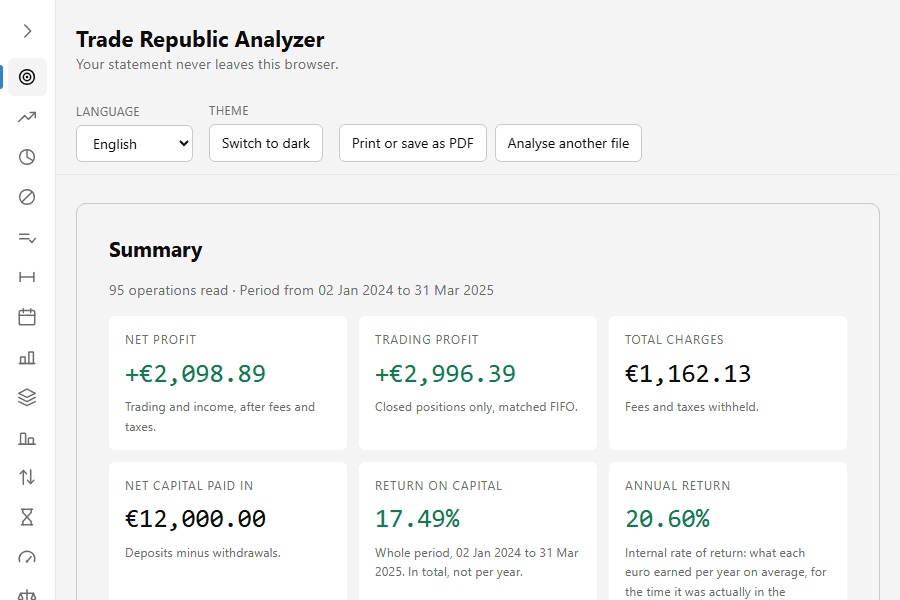
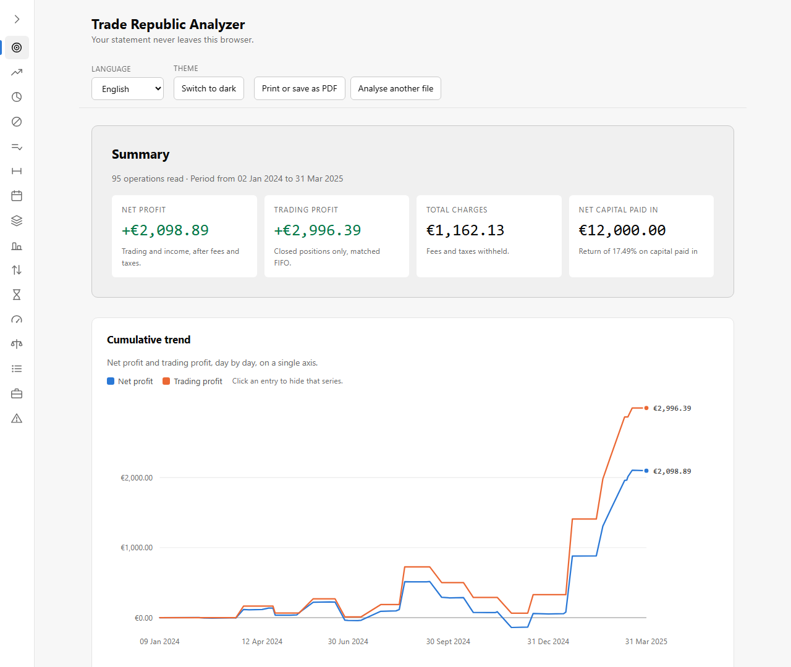
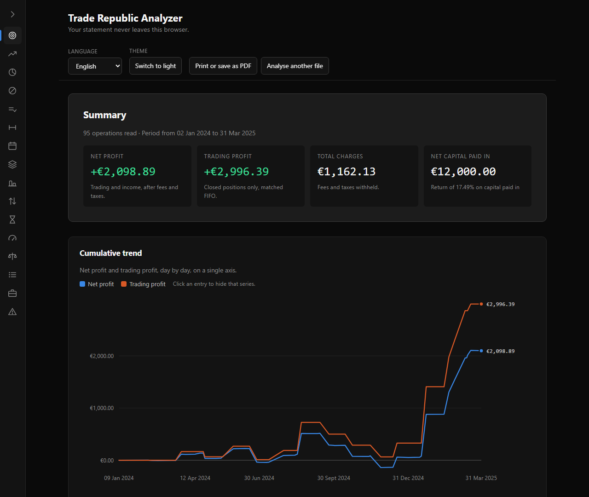

# Trade Republic Analyzer

I wanted to know what my Trade Republic account had actually earned, and the app
only ever showed me a running balance. So I wrote this. You drop the CSV export
on the page and get back a report: realized profit matched FIFO, a cumulative
trend, monthly figures, holding times, a breakdown per security. The file never
leaves your browser.

[Open the analyzer](https://schengatto.github.io/trade-republic-analyzer/)



<details>
<summary>The same report as stills, in light and dark</summary>





</details>

*Every image here comes from `tests/fixtures/demo-account.csv`, an account I made
up. No real export appears anywhere in this repository.*

## What it reports

- Realized profit, matched lot by lot with FIFO, in exact decimal arithmetic
- A cumulative trend of net profit and trading profit, day by day
- Rolling windows from one day to one year, plus the full period
- Monthly profit, and how many BUY and SELL rows each month held
- Profit by asset class, win rate with average win and average loss, your best
  and worst securities, average and median holding time
- Detail per security, and the positions still open, valued at cost
- A cash reconciliation: a second pass over the cash movements, independent of
  the FIFO engine, that has to agree with it to the cent
- Seven languages, light and dark, and a print stylesheet that gives you a clean
  PDF out of the browser's own print dialogue

## Your file stays on your machine

There is no server. The page is static, and the parsing, the arithmetic and the
drawing all happen in your tab.

Please check that rather than take my word for it. Open the Network tab in your
browser's developer tools, load your CSV, read the whole report, and watch the
request list stay empty. Better still, disconnect from the network once the page
has loaded and keep using it. Nothing changes, because there is no CDN, no
remote font, no analytics and no error reporting.

`localStorage` holds three preferences and nothing else: `tra.language`,
`tra.theme` and `tra.rail`. Your export is never written to storage, and
reloading the page throws the report away.

I did not want that resting on prose alone, so a test sweeps every file under
`src/ui/` and fails the build if one of them names `fetch`, `XMLHttpRequest`,
`WebSocket`, `EventSource`, `sendBeacon` or `importScripts`, or reaches storage
outside `src/ui/preferences.ts`.

For the full picture, including what GitHub Pages itself can see, read
[PRIVACY.md](PRIVACY.md).

## Getting your export out of Trade Republic

1. Open the Trade Republic app.
2. Go to your profile, then **Transactions** (*Transazioni*).
3. Ask for the transaction export as CSV. The PDF statement is a different file
   and this tool cannot read it.
4. It arrives by email or in the app's document inbox. Download it.
5. Drop it on the analyzer, or use **Choose CSV file**.

Leave the headers as they were exported. If a column the parser needs is
missing, the page names it and stops rather than guessing.

## Running it locally

You need Node 24.15.0 or newer. That floor comes from the test toolchain, not
from the page, which is static and runs anywhere.

```bash
git clone https://github.com/Schengatto/trade-republic-analyzer.git
cd trade-republic-analyzer
npm install
npm run dev        # http://localhost:5173
```

Load `tests/fixtures/demo-account.csv` if you want a populated report without
feeding it your own data.

To build the static site:

```bash
npm run build      # type-checks, writes dist/, then scans it for remote URLs
npm run preview
npm run test:e2e   # drives the build, fails on any request beyond its own assets
```

`dist/` is a plain folder of files. Any static host will serve it, and so will
opening it off disk.

The images above are generated rather than taken by hand: `npm run capture:demo`
rebuilds the site, drives it with Playwright and rewrites `docs/screenshots/`.
A README picture goes stale in a way no test notices, so this is how it catches
up when a section changes shape.

## Deploying it

Pushing to `main` builds and publishes to GitHub Pages via
`.github/workflows/pages.yml`, behind the same lint, typecheck and test gate CI
runs. `vite.config.ts` sets a relative `base`, so the same build works from a
project subpath and from `file://`.

For your own copy: fork the repository, then set **Settings > Pages > Source**
to **GitHub Actions**.

## How it is built

TypeScript, [Vite](https://vitejs.dev), [Vitest](https://vitest.dev). Two
runtime dependencies, [decimal.js](https://github.com/MikeMcl/decimal.js) for
exact money arithmetic and [PapaParse](https://www.papaparse.com) for the CSV.
No UI framework, and no chart library either: the charts are inline SVG I wrote
by hand, which has the side benefit that they print as vectors instead of
blurred bitmaps.

```
src/core/   parsing, classification, FIFO, reconciliation, analytics
src/ui/     rendering only. It calls src/core/ and does no arithmetic itself
tests/      mirrors both, plus the structural guards described above
```

Two decisions are worth calling out. Money is `decimal.js` at precision 28 with
`ROUND_HALF_EVEN` everywhere and never a float. And the cash reconciliation is a
genuinely separate route to the same number, so a bug in the FIFO engine surfaces
as a disagreement printed on the page instead of a plausible wrong figure.

## What it does not do

The report states these too, because these numbers are easy to misread without
them.

1. It is not a tax calculation, and it is not an Italian tax base. Leveraged
   certificates and harmonised ETFs get summed together here, while Italian tax
   law separates *redditi diversi*, which offset losses, from *redditi di
   capitale*, which do not. Carried-forward losses are not handled at all.
2. No unrealized gains. Open positions are valued at what they cost, because the
   export carries no current prices. You cannot get your portfolio's market
   value out of this file alone.
3. No risk metrics, for the same reason. Volatility, Sharpe, Sortino, beta, VaR,
   drawdown and correlations all need quotes, and a statement records
   transactions.
4. Trade Republic only. The format is specific to that export.
5. Currency is unverified. The file I built this against is essentially all EUR,
   so behaviour on `original_currency` and `fx_rate` is not something I claim
   works. If your file has non-euro operations, check the totals.

## Languages

Italian, English, German, Spanish, French, Dutch and Portuguese. The picker sits
in the header and the choice is remembered; a first visit follows the languages
your browser asks for and falls back to English.

Italian and English are written and reviewed. **The other five are
machine-assisted and have not been reviewed by a native speaker.** The legal and
methodological wording — the disclaimer, the stated limits, the reconciliation
verdict — was checked against the Italian by hand; the rest was not. If you read
one of these languages and something is wrong, a pull request changing one string
is genuinely welcome.

The remaining Trade Republic markets — Polish, Greek, Finnish, Slovak, Slovenian,
Estonian, Latvian and Lithuanian — are not here yet.

## Disclaimer

This gives you no tax or financial advice and produces no document valid for tax
purposes. It reads a file you already have and adds it up. Check anything that
matters against your broker's own statements, and where it really matters,
against a qualified professional.

## Contributing

Bug reports and pull requests are welcome, see [CONTRIBUTING.md](CONTRIBUTING.md).
One rule above all the others: no real data enters this repository, in any form.

## License

[MIT](LICENSE).
